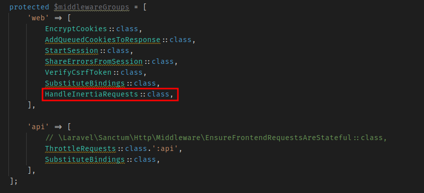

<a href="https://laravel.com" target="_blank"></a>
<a href="https://vuejs.org/" target="_blank"></a>
<a href="https://inertiajs.com/" target="_blank"></a>

## Custom Setup

If you want to configure vue.js3 and inertia custom, then you need below requirements.

* Laravel 10.
* PHP 8.1 or Greater

After this follow below steps.

### 1. Inertia Setup

We are following Inertia.js official documentation.

1. Copy and paste the below composer command.

```
composer require inertiajs/inertia-laravel
```

2. Go to resources/views if you don't found `app.blade.php` file then create it for our root view. (you can add tailwind or bootstrap classes in it as I mentioned bottstrap classes in my repository.
   )

```
<!DOCTYPE html>
<html>
  <head>
    <meta charset="utf-8" />
    <meta name="viewport" content="width=device-width, initial-scale=1.0, maximum-scale=1.0" />
    @vite('resources/js/app.js')
    @inertiaHead
  </head>
  <body>
    @inertia
  </body>
</html>
```

3. Create middleware.

```
php artisan inertia:middleware
```

4. Copy and paste below line into your `app/Http/Kernel.php` in **$middlewareGroups** `web` array like below image.
   

```
'web' => [
    // ...
    \App\Http\Middleware\HandleInertiaRequests::class,
],
```

5. Run below command.

```
npm install @inertiajs/vue3
```

### 2. Vue.js3 Setup

We are following Inertia.js official documentation.

1. Run below commands.

```
npm install vue@next
```

```
npm install @vitejs/plugin-vue
```

2. Go to `vite.config.js` file in the root directory and replace with below codes.

```
import {defineConfig} from 'vite';
import laravel from 'laravel-vite-plugin';
import vue from '@vitejs/plugin-vue';

export default defineConfig({
    plugins: [
        laravel({
            input: ['resources/css/app.css', 'resources/js/app.js'],
            refresh: true,
        }),
        vue({
            template: {
                transformAssetUrls: {
                    bas: null,
                    includeAbsolute: false
                }
            }
        })
    ],
});
```

3. Go to `resources/js/app.js` file and replace with below codes.

```
import './bootstrap';

import {createApp, h} from 'vue'
import {createInertiaApp} from '@inertiajs/vue3'

createInertiaApp({
    resolve: name => {
        const pages = import.meta.glob('./Pages/**/*.vue', {eager: true})
        return pages[`./Pages/${name}.vue`]
    },
    setup({el, App, props, plugin}) {
        createApp({render: () => h(App, props)})
            .use(plugin)
            .mount(el)
    },
})
```

### 3. Last Setup

Just setup your pages in `resources/js/Pages` folder or if you want to something else so also change the folder name in app.js file above.

`npm install`
<br />
`npm run dev`